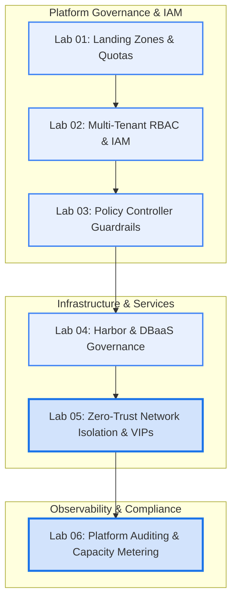

# GDC Air-Gapped Platform Administrator (PA) Track

## Overview & Mission

The **GDC Platform Administrator (PA) Track** is an enterprise-grade curriculum designed for infrastructure architects, security leads, and system administrators responsible for operating **Google Distributed Cloud (GDC) Air-Gapped** environments.

While the Application Operator (AO) track focuses on deploying containerized microservices and workloads, the Platform Administrator track equips you to design, secure, govern, and meter the underlying multi-tenant platform.



---

## Architectural Pillars

```
+---------------------------------------------------------------------------------------------------+
|                                 GDC Air-Gapped Management Domain                                  |
|                                                                                                   |
|   +--------------------------+  +--------------------------+  +-------------------------------+   |
|   | 1. Multi-Tenant Identity |  | 2. Zero-Trust Networking |  | 3. Policy & Compliance        |   |
|   |  - GDC Organizations     |  |  - Baseline Default-Deny |  |  - Gatekeeper / OPA           |   |
|   |  - Keycloak OIDC Groups  |  |  - Cross-Tenant Contracts|  |  - Non-Root & Limits Guard    |   |
|   |  - CI/CD ServiceAccounts |  |  - MetalLB VIP Pools     |  |  - Registry Provenance Rules  |   |
|   +--------------------------+  +--------------------------+  +-------------------------------+   |
|                                                                                                   |
|   +--------------------------+  +--------------------------+  +-------------------------------+   |
|   | 4. Shared Services       |  | 5. Security & Auditing   |  | 6. FinOps & Metering          |   |
|   |  - Harbor Registry Quotas|  |  - RequestResponse Tiers |  |  - Prometheus Recording Rules |   |
|   |  - Trivy CVE Scan Gating |  |  - SIEM / Vault Sinks    |  |  - Resource Headroom Engine   |   |
|   |  - Managed DBaaS Clusters|  |  - Forensic Log Parsing  |  |  - Chargeback Allocation Units|   |
|   +--------------------------+  +--------------------------+  +-------------------------------+   |
+---------------------------------------------------------------------------------------------------+
```

---

## Curriculum Roadmap

| Module | Title | Primary Focus | Key Tools & Artifacts |
| :--- | :--- | :--- | :--- |
| **Lab 01** | **[Multi-Tenant Landing Zones & Quotas](./lab-01-landing-zone-quotas/LAB-01.md)** | Multi-tier project hierarchies, ResourceQuotas, LimitRanges, and quota admission testing. | `apply-landing-zone.py`, `verify-quotas.sh` |
| **Lab 02** | **[Air-Gapped RBAC & Identity Governance](./lab-02-rbac-and-identity/LAB-02.md)** | Keycloak OIDC group mappings, least-privilege RoleBindings, and automated CI/CD tokens. | `provision-rbac.py`, `test-permissions.sh` |
| **Lab 03** | **[Policy Controller Guardrails & Compliance](./lab-03-policy-guardrails/LAB-03.md)** | Gatekeeper/OPA admission control, non-root constraints, and trusted Harbor registry provenance. | `deploy-guardrails.sh`, `test-policies.sh` |
| **Lab 04** | **[Harbor & DBaaS Shared Services Governance](./lab-04-harbor-dbaas-governance/LAB-04.md)** | Harbor vulnerability scanning/retention gating, and managed PostgreSQL/AlloyDB Omni provisioning. | `configure-harbor-governance.py`, `provision-tenant-db.sh` |
| **Lab 05** | **[Zero-Trust Network Isolation & VIPs](./lab-05-network-isolation/LAB-05.md)** | Baseline default-deny policies, cross-tenant service contracts, and MetalLB VIP address pools. | `apply-network-security.sh`, `test-network-isolation.sh` |
| **Lab 06** | **[Platform Auditing & Capacity Metering](./lab-06-audit-and-metering/LAB-06.md)** | GDC audit policy tiers, forensic inspection for IAM/security mutations, and tenant chargeback reports. | `inspect-audit-logs.py`, `calculate-tenant-metering.py` |

---

## Lab Details & Deep Dives

### [Lab 01: Multi-Tenant Landing Zones & Quotas](./lab-01-landing-zone-quotas/LAB-01.md)
- **Directory**: `pa-track/lab-01-landing-zone-quotas/`
- **Key Concepts**:
  - Designing multi-tier project topologies (`finance-dev`, `finance-prod`, `analytics-lab`).
  - Enforcing compute, memory, GPU, and LoadBalancer VIP quotas via `ResourceQuota`.
  - Auto-injecting baseline container requests/limits with `LimitRange`.
  - Testing admission rejections when tenants exceed quotas via `04-test-overquota-workload.yaml`.

### [Lab 02: Air-Gapped RBAC & Identity Governance](./lab-02-rbac-and-identity/LAB-02.md)
- **Directory**: `pa-track/lab-02-rbac-and-identity/`
- **Key Concepts**:
  - Mapping Keycloak OIDC enterprise groups (`finance-admins-grp`, `finance-devs-grp`, `auditors-grp`) to GDC roles.
  - Enforcing separation of duties (developer read-write in dev vs read-only audit in prod).
  - Provisioning scoped `ServiceAccount` credentials for automated CI/CD pipelines (GitLab/Jenkins).
  - Running a 24-point authorization test matrix with `test-permissions.sh`.

### [Lab 03: Policy Controller Guardrails & Compliance](./lab-03-policy-guardrails/LAB-03.md)
- **Directory**: `pa-track/lab-03-policy-guardrails/`
- **Key Concepts**:
  - Deploying Policy Controller (Gatekeeper/OPA) ConstraintTemplates and Constraints.
  - Blocking privileged containers, privilege escalation, and `hostPath` volume mounts.
  - Mandating container image provenance from the internal Harbor registry (`harbor.zone1.google.gdch.test/*`).
  - Verifying admission rejections with `test-policies.sh`.

### [Lab 04: Harbor & DBaaS Shared Services Governance](./lab-04-harbor-dbaas-governance/LAB-04.md)
- **Directory**: `pa-track/lab-04-harbor-dbaas-governance/`
- **Key Concepts**:
  - Automating Trivy vulnerability scanning, CVE severity threshold blocking, and tag immutability in Harbor.
  - Provisioning managed PostgreSQL / AlloyDB Omni database instances for tenant workloads.
  - Configuring automated snapshot backup policies and Point-In-Time Recovery (PITR).
  - Validating end-to-end database provisioning with `provision-tenant-db.sh`.

### [Lab 05: Zero-Trust Network Isolation & VIP Management](./lab-05-network-isolation/LAB-05.md)
- **Directory**: `pa-track/lab-05-network-isolation/`
- **Key Concepts**:
  - Preventing lateral movement across tenant projects using Kubernetes CNI NetworkPolicies.
  - Preserving cluster control-plane and CoreDNS egress.
  - Creating declarative inter-service communication contracts between `frontend-project` and `backend-api-project`.
  - Dedicating isolated MetalLB IP Address Pools for LoadBalancer services.
  - Running automated verification probes with `test-network-isolation.sh`.

### [Lab 06: Platform Auditing, Compliance Tracking & Capacity Metering](./lab-06-audit-and-metering/LAB-06.md)
- **Directory**: `pa-track/lab-06-audit-and-metering/`
- **Key Concepts**:
  - Configuring hierarchical Kubernetes API audit policies for NIST 800-53 and FedRAMP compliance.
  - Routing audit event streams to centralized SIEM and long-term object storage sinks.
  - Inspecting privilege escalation attempts, secret access, and policy tampering via `inspect-audit-logs.py`.
  - Deploying Prometheus recording rules for real-time per-tenant CPU, memory, and storage aggregation.
  - Computing tenant quota headroom and chargeback metrics with `calculate-tenant-metering.py`.

---

## Quickstart for Platform Administrators

1. **Initialize Environment**:
   ```bash
   cd ~/gdc-ag/gdc-sandbox-workshop
   source .env
   login
   ```

2. **Execute Landing Zone & Quotas (Lab 01)**:
   ```bash
   python3 ./pa-track/lab-01-landing-zone-quotas/scripts/apply-landing-zone.py
   ./pa-track/lab-01-landing-zone-quotas/scripts/verify-quotas.sh
   ```

3. **Deploy Policy Guardrails (Lab 03)**:
   ```bash
   ./pa-track/lab-03-policy-guardrails/scripts/deploy-guardrails.sh
   ./pa-track/lab-03-policy-guardrails/scripts/test-policies.sh
   ```

4. **Execute Network Security & Isolation (Lab 05)**:
   ```bash
   ./pa-track/lab-05-network-isolation/scripts/apply-network-security.sh
   ./pa-track/lab-05-network-isolation/scripts/test-network-isolation.sh --mock
   ```

5. **Run Audit & Resource Metering (Lab 06)**:
   ```bash
   ./pa-track/lab-06-audit-and-metering/scripts/inspect-audit-logs.py
   ./pa-track/lab-06-audit-and-metering/scripts/calculate-tenant-metering.py --mock
   ```
